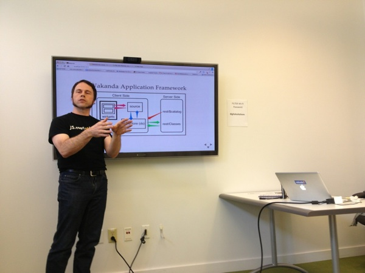

# Some of my 2013 Talks

In my role at 4D I am a Developer Advocate I speak a bit at meetups and conferences.

Here are my slides and notes for 2013. After the event I will add some more information about the talk to the slides so that they act a bit like a journal.

This repo is hosted as a website at http://2013-talks.lyle.troxell.com .

-Lyle

## Upcoming Talks
* 2013-07-24 NoVa.JS, Washington DC - [NoVa.JS Meetup](http://www.meetup.com/NoVaJS/)
* 2013-07-25 NYC.JS, New York, NY - [NYC.JS Meetup](http://www.meetup.com/NYC-JS/)
* [2013-10-5/6 Silicon Valley Code Camp](http://www.siliconvalley-codecamp.com/Presenter/2013/Session/Lyle-Troxell-10271)
* [2013-10- 4D Summit, Los Vegas, NV - hosting event](http://www.4d.com/company/events/summit2013.html)
* [2013-10-25 JS.everywhere(2013), San Fransisco, CA -  hosting event](http://jseverywere.org)
## Past Talks

* [2013-06-14 Web-5 Conference, Béziers, France](http://conf2013.web-5.org/speaker/lyle-troxell-get-the-server-side-out-of-the-way-with-wakanda/) - [web-5.html](web-5.html)
* [2013-05-21 Seattle JS](http://www.meetup.com/seattlejs/events/117660102/) - [seattle.html](seattle.html)
* [2013-05-20  Seattle Web App Developers Group](http://www.meetup.com/Seattle-Web-App-Developers-Group/events/115969082/) - [seattle.html](seattle.html)
* [2013-03-19 Lyle Leaves UCSC, Santa Cruz](http://lyle.troxell.com/talks/2013/ucsc/)

---

Got any photos of an event I participated in? Send me a pull request! or just email. - Thanks

